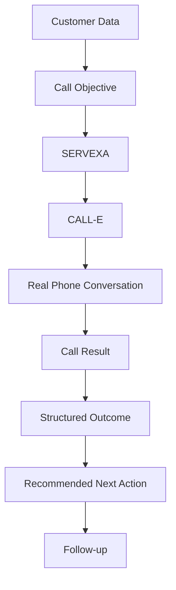

## SERVEXA

Customer care that follows through.

SERVEXA is an AI-powered customer-care workforce for financial services. It uses CALL-E to conduct purposeful customer conversations and turns those conversations into structured outcomes, recommended next actions, and follow-up work.

## Overview

Financial organizations handle large volumes of conversations about repayment, payment status, reminders, recovery, and follow-up. Human teams cannot manually conduct every routine conversation or reliably capture what happened after each call.

SERVEXA is built around the complete operational workflow:

> Customer context -> Call objective -> Voice conversation -> Customer response -> Structured outcome -> Recommended next action -> Follow-up

The objective is not simply to complete a phone call. The objective is to understand the customer's situation and make the next step visible to the organization.

## The Problem

A customer may be ready to pay, may have already paid, may be unable to pay, or may need more time. They may have experienced income difficulty, dispute an amount, request human assistance, or require a later follow-up.

The operational question after the call is: what did the customer actually say, what is their situation, and what should the organization do next?

## The Solution

SERVEXA creates a purposeful conversation rather than a generic check-in. A call begins with a customer record and a clear objective. CALL-E conducts the voice conversation, while SERVEXA stores the resulting operational information.

The conversation model follows this pattern:

> Purpose -> Understand -> Empathy -> Resolve -> Confirm -> Record

Human-directed calls can include an operator-provided question, additional context, reference information, payment amount, currency, and due date. These instructions are incorporated into the CALL-E task prompt and stored alongside the call.

## How It Works



1. A customer is added or selected from the Customers screen.
2. The operator starts a standard call or opens the directed-call flow.
3. For a directed call, the operator selects a template and provides any required context.
4. SERVEXA creates a local call record before sending the request to CALL-E.
5. CALL-E conducts the phone conversation and extracts a structured result.
6. CALL-E sends a terminal event to the Supabase webhook, or the operator can use Refresh status while waiting.
7. SERVEXA stores the status, transcript, summary, outcome, activity, and any escalation follow-up.
8. Activity rows open a full call report for review.

## Core Features

- Customer records with name and E.164 phone number.
- Customer search and status filtering.
- Standard AI customer-care calls.
- Human-directed calls with template selection.
- Custom questions, context, amounts, due dates, and reference information.
- CALL-E structured result extraction.
- Call status, duration, timestamps, and transcript storage when returned by CALL-E.
- Activity dashboard backed by Supabase records.
- Clickable call reports with outcome, summary, sentiment, next action, transcript, and follow-ups.
- Follow-up scheduling from a customer record.
- Follow-up completion from a call report.
- Anonymous Supabase sessions with persisted sessions on native platforms.
- Responsive Expo web interface and native Expo configuration.

## Call Templates

The directed-call flow currently includes six templates:

| Template | Purpose |
| --- | --- |
| Loan Recovery | Understand repayment status and identify an appropriate next step. |
| Payment Reminder | Remind the customer about an upcoming or overdue payment and understand whether assistance is needed. |
| Payment Confirmation | Confirm whether a payment was made and identify discrepancies. |
| Customer Follow-up | Reconnect with a customer who needs another conversation or confirmation. |
| Repayment Assistance | Explore payment options and assistance programs. |
| Account Inquiry | Address questions about account status and details. |

Templates are represented in the current call-instruction screen and seeded in the `call_templates` table. The selected template is passed to the backend as `template_name`.

## Customer Conversations

The Customers screen supports adding a customer, reviewing their record, starting a standard AI call, and opening a directed call. A customer can be passed directly into the directed-call flow so the operator does not need to select the same customer twice.

The directed-call wizard has four stages:

1. Select customer.
2. Select a call template.
3. Add details and human-directed instructions.
4. Review and initiate the call.

The backend validates the customer, creates a local call record, stores the instruction record, builds the CALL-E task, and returns the internal and provider call identifiers.

## Reports and Outcomes

The Activity screen lists stored customer interactions. A call activity with a `call_id` is clickable and opens the Call Report screen.

The report can display:

- CALL-E and SERVEXA call status.
- Customer name and call timestamp.
- Outcome, including resolved, follow-up needed, escalation, and other terminal states.
- CALL-E summary and sentiment.
- Recommended next action.
- Full transcript when CALL-E returns transcript turns.
- Duration, start time, and end time.
- Follow-up tasks, due dates, descriptions, and completion controls.

If a webhook was delayed, Activity includes a Refresh status action. It calls `sync-call-status`, fetches the current terminal snapshot from CALL-E, and backfills the local records.

## Architecture

SERVEXA is a client application backed by Supabase and Supabase Edge Functions. The CALL-E API key is used only inside server-side Edge Functions.

```text
Expo Router web/native client
            |
            | Supabase client and anonymous session
            v
Supabase Postgres <---- calle-webhook <---- CALL-E terminal event
            ^                    ^
            |                    |
            +---- Edge Functions-+
                     start-customer-call
                     sync-call-status
                              |
                              v
                     CALL-E Calls API
```

## Data Flow

1. `customers` stores customer identity and contact information.
2. `start-customer-call` creates a `calls` row with status `queued`.
3. The function optionally creates a `call_instructions` row.
4. The function sends a task, recipients, result schema, metadata, and webhook URL to CALL-E.
5. The returned CALL-E call ID is stored as `provider_call_id`.
6. CALL-E sends `call.completed`, `call.failed`, or `call.result_validation_failed` to `calle-webhook`.
7. The webhook updates `calls`, inserts `call_outcomes`, creates `activities`, and creates `follow_ups` for escalations.
8. `sync-call-status` provides a manual recovery path by fetching `GET /v1/calls/{call_id}` from CALL-E.

## CALL-E Integration

Calls are created with `POST https://api.heycall-e.com/v1/calls`.

The request includes:

- `task`: the SERVEXA customer-care system prompt and selected call objective.
- `recipients`: the customer's E.164 phone number, region, and locale.
- `result_schema`: the structured fields CALL-E should extract.
- `metadata`: the internal SERVEXA call ID and customer ID.
- `webhook_url`: the public Supabase webhook endpoint.
- `Idempotency-Key`: the internal call ID.

The result schema requests outcome, customer summary, sentiment, payment status, stated difficulty, promised payment date, follow-up requirement, escalation reason, and next action.

CALL-E's terminal webhook envelope is validated using the `CALL-E-Event-Id` header and the event body ID. Transcript turns are converted into a readable transcript and stored on the local call record.

## Technical Stack

- Expo SDK 57.
- React 19 and React Native 0.86.
- Expo Router with file-based routes.
- TypeScript.
- Supabase Postgres.
- Supabase Auth anonymous sessions.
- Supabase Edge Functions running on Deno.
- CALL-E Calls API for voice conversations and structured results.
- Vercel static hosting for the web export.
- AsyncStorage for persisted native Supabase sessions.

## Project Structure

```text
src/
   app/
      _layout.tsx          Root navigation
      index.tsx            Overview dashboard
      customers.tsx        Customer list and customer detail flow
      call-instruction.tsx Directed-call wizard and templates
      call-detail.tsx      Full call report
      activity.tsx         Activity dashboard and status refresh
      campaigns.tsx        Campaigns surface, currently coming soon
      settings.tsx         Settings screen
   lib/
      supabase.ts          Shared Supabase client and session bootstrap

supabase/
   functions/
      start-customer-call/ Creates local calls and calls CALL-E
      calle-webhook/       Persists CALL-E terminal events
      sync-call-status/    Fetches and backfills CALL-E call results
   migrations/            Postgres schema, templates, and RLS policies

app.json                 Expo configuration
vercel.json              Vercel static export configuration
```

## Local Development

### Prerequisites

- Node.js 18 or newer.
- A Supabase project with the database migrations applied.
- A CALL-E API key for making live calls.
- Vercel CLI only if deploying manually.

### Install and run

```bash
npm install
npm run web
```

The Expo web development server normally runs at `http://localhost:8081`.

Other available commands:

```bash
npm run start
npm run android
npm run ios
npm run lint
```

`npm run lint` may prompt to create an ESLint configuration if one is not present.

### Database setup

Link the Supabase CLI to the project, then apply migrations:

```bash
npx supabase link --project-ref YOUR_PROJECT_REF
npx supabase db push
```

Deploy the Edge Functions:

```bash
npx supabase functions deploy start-customer-call
npx supabase functions deploy calle-webhook
npx supabase functions deploy sync-call-status
```

Configure the server-side secret before making calls:

```bash
npx supabase secrets set CALLE_API_KEY=YOUR_CALLE_API_KEY
```

## Environment Variables

The Expo client reads these public variables from `.env.local`:

```text
EXPO_PUBLIC_SUPABASE_URL=https://YOUR_PROJECT_REF.supabase.co
EXPO_PUBLIC_SUPABASE_ANON_KEY=YOUR_PUBLIC_SUPABASE_KEY
```

Do not commit `.env.local` or expose server secrets in the client. Supabase Edge Functions use these server-side variables and secrets:

```text
SUPABASE_URL
SUPABASE_SERVICE_ROLE_KEY
CALLE_API_KEY
```

`SUPABASE_SERVICE_ROLE_KEY` and `CALLE_API_KEY` must never be placed in Expo environment variables or browser code.

## Deployment

### Web deployment with Vercel

The repository uses a static Expo export:

```bash
npx vercel --prod
```

The Vercel configuration runs `npx expo export -p web`, publishes `dist`, and enables clean URLs for routes such as `/customers`, `/activity`, and `/call-detail`.

The current deployed web application is:

https://servexa.vercel.app/

Vercel must have `EXPO_PUBLIC_SUPABASE_URL` and `EXPO_PUBLIC_SUPABASE_ANON_KEY` configured as environment variables for the deployment environment.

### Native builds

The Expo configuration includes Android and iOS settings. Native builds can be produced with EAS after the relevant app-store credentials and project configuration are supplied:

```bash
npx eas build --platform android
npx eas build --platform ios
```

## Hackathon

SERVEXA demonstrates a workflow-first approach to AI voice operations. The differentiator is not only initiating an AI call. It is the operational loop around the call: defining intent, collecting structured evidence, recording the result, surfacing the next action, and making follow-up accountable.

The project is especially suited to evaluating:

- Human-directed AI voice workflows.
- Structured extraction from natural conversations.
- Webhook-driven asynchronous systems.
- Recovery when webhook delivery is delayed.
- A customer-care interface designed for repeated operational use.

## Demo / Testing

Use the deployed application or run the web app locally.

Recommended review path:

1. Open Customers.
2. Add a customer with an E.164 phone number.
3. Optionally choose a call template while adding the customer.
4. Open the directed-call flow.
5. Select one of the six templates.
6. Add a specific question or amount context.
7. Review and initiate a live CALL-E call.
8. Open Activity and use Refresh status if the terminal webhook has not arrived.
9. Click the completed activity row to open the full call report.
10. Review the summary, outcome, transcript, recommended action, and follow-up.

Live calls can incur provider charges and require a valid CALL-E API key and reachable phone number. Test with permission and with a number appropriate for the configured region.

## Limitations

- The current client uses anonymous Supabase sessions rather than a full user registration and login experience.
- Data is scoped by the anonymous session's Supabase user ID. A new browser or cleared session will not see another session's customer records.
- Campaign automation is currently a coming-soon surface; campaign cards and campaign creation are not connected to live campaign data.
- Billing and plan usage are not connected to a metering system.
- CALL-E result extraction is schema-guided rather than a hard guarantee that every conversational instruction was followed.
- Transcripts are available only when CALL-E returns transcript turns.
- Webhook delivery is asynchronous. Refresh status is provided as a recovery path while waiting for terminal events.
- The current report is a call report, not a general analytics or financial reporting system.
- Automated test coverage and a production authentication flow are not included in the current repository.

## Future Direction

Potential next steps, subject to product and security requirements, include:

- Replace anonymous sessions with organization accounts, roles, and invitations.
- Build real campaign creation, audience selection, scheduling, pausing, and progress tracking.
- Add event-level idempotency storage for webhook deliveries.
- Add explicit call report filtering, export, and audit history.
- Add stronger structured validation and review workflows for sensitive outcomes.
- Add consent, recording policy, retention, and regional compliance controls.
- Add automated integration tests for CALL-E event fixtures and report persistence.
- Add operational metrics only after a real billing and usage source is connected.

## Author

SERVEXA is maintained by the project author and contributors in this repository.

## Submission Links

- Repository: https://github.com/princeakpabio8-prog/servexa
- Live demo: https://servexa.vercel.app/
- Supabase project dashboard: configured for the project deployment and not intended as a public demo link.

1. Install dependencies

   ```bash
   npm install
   ```

2. Start the app

   ```bash
   npx expo start
   ```

In the output, you'll find options to open the app in a

- [development build](https://docs.expo.dev/develop/development-builds/introduction/)
- [Android emulator](https://docs.expo.dev/workflow/android-studio-emulator/)
- [iOS simulator](https://docs.expo.dev/workflow/ios-simulator/)
- [Expo Go](https://expo.dev/go), a limited sandbox for trying out app development with Expo

You can start developing by editing the files inside the **app** directory. This project uses [file-based routing](https://docs.expo.dev/router/introduction).

## Get a fresh project

When you're ready, run:

```bash
npm run reset-project
```

This command will move the starter code to the **app-example** directory and create a blank **app** directory where you can start developing.

### Other setup steps

- To set up ESLint for linting, run `npx expo lint`, or follow our guide on ["Using ESLint and Prettier"](https://docs.expo.dev/guides/using-eslint/)
- If you'd like to set up unit testing, follow our guide on ["Unit Testing with Jest"](https://docs.expo.dev/develop/unit-testing/)
- Learn more about the TypeScript setup in this template in our guide on ["Using TypeScript"](https://docs.expo.dev/guides/typescript/)

## Learn more

To learn more about developing your project with Expo, look at the following resources:

- [Expo documentation](https://docs.expo.dev/): Learn fundamentals, or go into advanced topics with our [guides](https://docs.expo.dev/guides).
- [Learn Expo tutorial](https://docs.expo.dev/tutorial/introduction/): Follow a step-by-step tutorial where you'll create a project that runs on Android, iOS, and the web.

## Join the community

Join our community of developers creating universal apps.

- [Expo on GitHub](https://github.com/expo/expo): View our open source platform and contribute.
- [Discord community](https://chat.expo.dev): Chat with Expo users and ask questions.
